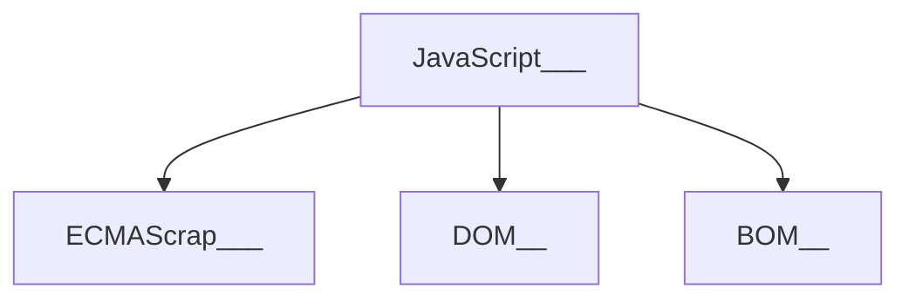
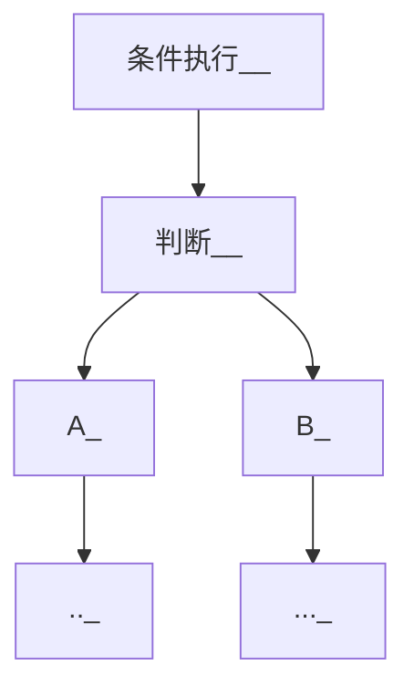

# JavaScript


> 词汇目录

------

## 1.初识JavaScript

#### 1.1 JavaScript是什么

- JavaScript 是世界上最流行的语言之一，是一种==运行在客户端的脚本语言== （Script 是脚本的意思）

- 脚本语言：==不需要编译==，运行过程中由JavaScript解释器(JavaScript 引擎）逐行来进行解释并执行

- 现在也可以基于 `Node.js `技术进行服务器端编程

#### 1.2 JavaScript的作用

- 表单动态校验（密码强度检测） （ JS 产生最初的目的 ）

- 网页特效

- 服务端开发(`Node.js`)

- 桌面程序(`Electron`)

- App(`Cordova`) 

- 控制硬件-物联网(`Ruff`)

- 游戏开发(`cocos2d-js`)

#### 1.3 HTML / CSS/ JavaScript 的关系

|              **HTML/CSS 标记语言--描述类语言**               |              **JS 脚本语言--编程类语言**               |
| :----------------------------------------------------------: | :----------------------------------------------------: |
|   HTML 决定网页结构和内容( 决定看到什么 )，相当于人的身体    | 实现业务逻辑和页面控制( 决定功能 )，相当于人的各种动作 |
| CSS 决定网页呈现给用户的模样( 决定好不好看 )，相当于给人穿衣服、化妆 |                                                        |

#### 1.4 浏览器执行 JavaScript简介

​	浏览器分成两部分：渲染引擎和 JS 引擎

- **渲染引擎**：用来解析HTML与CSS，俗称内核，比如 chrome 浏览器的 blink ，老版本的 webkit

- **JS** **引擎**：也称为 JS 解释器。 用来读取网页中的JavaScript代码，对其处理后运行，比如 chrome 浏览器的 V8

> 浏览器本身并不会执行JS代码，而是通过内置 JavaScript 引擎(解释器) 来执行 JS 代码 。JS 引擎执行代码时逐行解释每一句源码（转换为机器语言），然后由计算机去执行，所以 JavaScript 语言归为脚本语言，会逐行解释执行。

#### 1.5 JavaScript的组成



- **ECMAScript** 是由ECMA 国际（ 原欧洲计算机制造商协会）进行标准化的一门编程语言，这种语言在万维网上应用广泛，它往往被称为 JavaScript 或 JScript，但实际上后两者是 ECMAScript 语言的实现和扩展。==JavaScript语法==

- **DOM**（Document Object Model，简称DOM），是W3C组织推荐的处理可扩展标记语言的标准编程接口。通过 DOM 提供的接口可以对页面上的各种元素进行操作（大小、位置、颜色等）。==页面文档对象模型==
- **BOM** (Browser Object Model，简称BOM) 是指浏览器对象模型，它提供了独立于内容的、可以与浏览器窗口进行互动的对象结构。通过BOM可以操作浏览器窗口，比如弹出框、控制浏览器跳转、获取分辨率等。==浏览器对象模型==

#### 1.6 JavaScript书写位置

- 行内式 JavaScript

  ```javascript
  <input type="button" value="点我试试" onclick="alert('Hello World')" />
  ```

- 内嵌式 JavaScript

  ```javascript
  <script>
      alert('Hello  World~!');
   </script>
  ```

- 外部 JavaScript文件

  ```javascript
  <script src="Demo.js"></script>
  ```

#### 1.7 单行、多行注释

```java
// 单行注释 （Ctrl  + /）
/*
   多行注释（Ctrl + shift + a）
*/
```

#### 1.8 JavaScript 输入输出语句

|        方法        | 说明                           |  归属  |
| :----------------: | :----------------------------- | :----: |
|    alert（msg）    | 浏览器弹出警示框               | 浏览器 |
| console.log（msg） | 浏览器控制台打印输出信息       | 浏览器 |
|   prompt（info）   | 浏览器弹出输入框，用户可以输入 | 浏览器 |

## 2.变量

#### 2.1 变量概述

​	变量在内存中的存储

- 变量是程序在内存申请的一块用来存放数据的空间

#### 2.2 变量的使用

> 变量在使用分为两步：1. 声明变量  2. 赋值

```javascript
// 1.声明变量
var _name; // 声明一个名称为 _name 的变量
```

- `var `是一个 JavaScript 关键字，用来声明变量( variable 变量的意思 )。使用该关键字声明变量后，计算机会自动为变量分配内存空间，不需要程序员管

- `_name` 是程序员定义的变量名，我们要通过变量名来访问内存中分配的  t空间

```javascript
 // 2.赋值
_name = 'Baniliy'; // 为变量 _name 赋值为 'Baniliy'
```

- `= ` 用来把右边的值赋给左边的变量空间中, 此处代表赋值的意思

```javascript
// 变量的初始化
var _name = 'Baniliy'; // 声明变量的同时赋值 'Baniliy'
// 同时声明多个变量
var _name = 'Banilily', _age = 20;
// 声明变量特殊情况
var _name; 
console.log(_name); 
// 只声明，不赋值 输出undefined
console.log(_name); 
// 不声明，不赋值，直接使用 报错
_name = 'Banilily'; 
console.log(_name); 
// 不声明，只赋值 输出'Banilily'

```

#### 2.3 变量命名规范

> - 由字母(A-Za-z)、数字(0-9)、下划线(_)、美元符号( $ )组成，如：usrAge, num01, _name
>
> - 严格区分大小写。var app; 和 var App; 是两个变量
>
> - 不能 以数字开头。 18age  是错误的
>
> - 不能 是关键字、保留字。例如：var、for、while
>
> - 变量名必须有意义。
>
> - 遵守==驼峰命名法==。首字母小写，后面单词的首字母需要大写。 myFirstName

#### 2.4 变量的数据类型

JavaScript 是一种==弱类型或者说动态语言==

JavaScript 把数据类型分为两类：

- 简单数据类型 （Number,String,Boolean,Undefined,Null）

- 复杂数据类型 （object)

#### 2.5 基本数据类型

| 简单数据类型 | 说明                                                        |
| :----------: | ----------------------------------------------------------- |
|    Number    | 数字型，包含整型值和浮点型值                                |
|   Boolean    | 布尔型，如`true`、`false`,等价于 **1 **和 **0**             |
|    String    | 字符串型 ，如"张三"                                         |
|  Undefined   | `var a`; 声明了变量 `a ` 但是没有赋值，此时 `a = undefined` |
|     Null     | `var a = null`; 声明了变量 `a` 为空值                       |

###### 2.5.1 数字型Number

1. JavaScript中数值的最大和最小值

```javascript
alert(Number.MAX_VALUE); // 1.7976931348623157e+308
alert(Number.MIN_VALUE); // 5e-324
```

2. 数字型三个特殊值

```javascript
alert(Infinity);  // Infinity
alert(-Infinity); // -Infinity
alert(NaN);       // NaN


```

​	`Infinity `，代表无穷大，大于任何数值
​	`-Infinity `，代表无穷小，小于任何数值
​	`NaN `，Not a number，代表一个非数值

3. **isNaN()** 

用来判断一个变量==是否为非数字==的类型，返回 true 或者 false

```javascript
var usrAge = 21;
var isOk = isNaN(userAge);
console.log(isNum);            // false ，21 不是一个非数字
var usrName = "andy";
console.log(isNaN(userName));  // true ，"andy"是一个非数字
```

###### 2.5.2 字符串型 String

​	字符串型可以是引号中的任意文本，其语法为 双引号 `" "` 和 单引号`' '`

1. 字符串引号嵌套

   JS 可以用单引号嵌套双引号 ，或者用双引号嵌套单引号 (==外双内单，外单内双==)

2. 字符串转义符

   类似HTML里面的特殊字符，字符串中也有特殊字符，我们称之为转义符。

   转义符都是` \ `开头的，常用的转义符及其说明如下

|  转义符  | 解释说明                       |
| :------: | ------------------------------ |
| ` \n  `  | 换行符，n  是  newline  的意思 |
| ` \ \  ` | 斜杠 ` \  `                    |
| `  \'  ` | `'  `单引号                    |
| `  \"  ` | ` ”`双引号                     |
| ` \t  `  | tab 缩进                       |
|  `\b `   | 空格 ，b  是  blank 的意思     |

3. 字符串长度

   字符串是由若干字符组成的，这些字符的数量就是字符串的长度。通过字符串的 `length `属性可以获取整个字符串的长度。

```javascript
var strMsg = "我是帅气多金的程序猿！";
alert(strMsg.length); // 显示 11
```

4. 字符串拼接

   - 多个字符串之间可以使用 `+` 进行拼接，其拼接方式为 字符串` + `任何类型 = 拼接之后的新字符串

   - 拼接前会把与字符串相加的任何类型转成字符串，再拼接成一个新的字符串

   ```javascript
   //1.1 字符串 "相加"
   alert('hello' + ' ' + 'world'); // hello world
   //1.2 数值字符串 "相加"
   alert('100' + '100'); // 100100
   //1.3 数值字符串 + 数值
   alert('11' + 12);     // 1112 
   ```

   ==数值相加 ，字符相连==

   ```javascript
   console.log('_name' + 18);           // 只要有字符就会相连 
   var age = 18;    
   console.log('_name' + age);          
   console.log('_name' + age + '岁'); 
   
   ```

###### 2.5.3 布尔型 Boolean

​	布尔类型有两个值：`true `和 `false` ，其中` true `表示真（对），而 `false `表示假（错）。

​	布尔型和数字型相加的时候， `true `的值为 1 ，`false` 的值为 0。

```javascript
console.log(true + 1);  // 2
console.log(false + 1); // 1

```

###### 2.5.4 Undefined 和 Null

​	一个声明后没有被赋值的变量会有一个默认值 `undefined` ( 如果进行相连或者相加时，注意结果）

```javascript
var variable;
console.log(variable);           // undefined
console.log('你好' + variable);  // 你好undefined
console.log(11 + variable);     // NaN
console.log(true + variable);   //  NaN
```

​	一个声明变量给 ` null ` 值，里面存的值为空

```javascript
var vari = null;
console.log('你好' + vari);  // 你好null
console.log(11 + vari);     // 11
console.log(true + vari);   //  1
```

#### 2.6 获取监测变量的数据类型

​	`typeof `可用来获取检测变量的数据类型

```javascript
var num = 18;
console.log(typeof num) // 结果 number      

```

| 类型      | 例如             | 结果        |
| :-------- | ---------------- | ----------- |
| String    | typeof"小白"     | “string”    |
| Number    | typeof 18        | "number"    |
| Boolean   | typeof true      | "boolean"   |
| Undefined | typeod undefined | "undefined" |
| Null      | typeof null      | "object"    |


#### 2.7 数据类型转换

> 使用表单、`prompt` 获取过来的数据默认是字符串类型的，此时就不能直接简单的进行加法运算，而需要转换变量的数据类型。通俗来说，就是把一种数据类型的变量转换成另外一种数据类型。

1. 转换为字符串

   | 方式             | 说明                         | 案例                                |
   | ---------------- | ---------------------------- | ----------------------------------- |
   | toString()       | 转换字符串                   | var num = 1; alert(num.toString()); |
   | String()强制转换 | 转换字符串                   | var num = 1; alert(String(num));    |
   | `+`连接隐式转换  | 和字符串拼接的结果都是字符串 | var num = 1; alert(num+"字符串");   |


2. 转换为数字型

   | 方式                 | 说明                           | 案例                |
   | -------------------- | ------------------------------ | ------------------- |
   | parseInt(string)     | 将string类型转换成整数数值型   | parseInt('78')      |
   | parseFloat(string)   | 将string类型转换成浮点型数值型 | parseFloat('78.21') |
   | Number()强制转换函数 | 将string类型转换成数值型       | Number('12')        |
   | JS隐式转换( - * /)   | 利用算术运算隐式转换为数值型   | '12' - 0            |

   隐式转换进行算数运算的时候，JS 自动转换了数据类型

   

## 3. 运算符

> 运算符（operator）也被称为操作符，是用于实现赋值、比较和执行算数运算等功能的符号。

JavaScript中常用的运算符有：

- 算数运算符[^1]

- 递增和递减运算符[^2]

- 比较运算符[^3]

- 逻辑运算符[^4]

- 赋值运算符[^5]

  

#### 3.1 算术运算符

​	概念：算术运算使用的符号，用于执行两个变量或值的算术运算。

| 运算符 |      描述      |      实例      |
| :----: | :------------: | :------------: |
|   +    |       加       |  num1 + num2   |
|   -    |       减       |  num1 - num2   |
|   *    |       乘       |  num1 * num2   |
|   /    |       除       |  num1 /  num2  |
|   %    | 取余数（取模） | 返回除法的余数 |


浮点数值的最高精度是 17 位小数，但在进行算术计算时其精确度远远不如整数。

==不能直接判断两个浮点数是否相等==

```javascript
var result = 0.1 + 0.2;    
// 结果不是 0.3，而是：0.30000000000000004
console.log(0.07 * 100);   
// 结果不是 7，  而是：7.000000000000001

```

**表达式：**是由数字、运算符、变量等以能求得数值的有意义排列方法所得的组合

简单理解：是由数字、运算符、变量等组成的式子


#### 3.2 递增和递减运算符

> 如果需要反复给数字变量添加或减去1，可以使用递增 `++` 和递减 `-- ` 运算符来完成。
>
> 在 JavaScript 中，递增 `++` 和递减 ` -- ` 既可以放在变量前面，也可以放在变量后面。放在变量前面时，我们可以称为前置递增（递减）运算符，放在变量后面时，我们可以称为后置递增（递减）运算符。
>
> **注意：**递增和递减运算符必须和变量配合使用。

###### 3.2.1 前置递增运算符

​	`++num `前置递增，就是自加1，类似于 `num = num + 1`，但是 `++num` 写起来更简单。

​	使用口诀：==先自加，后返回值==

###### 3.2.2 后置递增运算符

​	`num++` 后置递增，就是自加1，类似于 `num = num + 1 `，但是 `num++` 写起来更简单。

​	使用口诀：==先返回原值，后自加==

```javascript
// 练习
var a = 10;
++a;
var b = ++a + 2;
console.log(b); // 14

var c = 10;
c++;
var d = c++ + 2;
console.log(d); // 13

var e = 10;
var f = e++ + ++e; // 10 + 12
console.log(f);
```


#### 3.3 比较运算符

概念：比较运算符（关系运算符）是两个数据进行比较时所使用的运算符，比较运算后，会返回一个布尔值 `true / false` 作为比较运算的结果。

| 运算符名称 | 说明                           |   案例    |     结果     |
| :--------: | :----------------------------- | :-------: | :----------: |
|     <      | 小于号                         |   n < m   | true / false |
|     >      | 大于号                         |   n > m   | true / false |
|     >=     | 大于等于号                     |  n >= m   | true / false |
|     <=     | 小于等于号                     |  n <= m   | true / false |
|     ==     | 判等号（会转型）               |  n == m   | true / false |
|     !=     | 不等号                         |  n != m   | true / false |
|    ===     | 全等（要求值和数据类型都一致） | n === 'm' | true / false |


| 符号 | 作用 | 用法                                   |
| ---- | ---- | -------------------------------------- |
| =    | 赋值 | 把右边赋值给左边                       |
| ==   | 判断 | 判断两边==值==是否相等（存在隐式转换） |
| ===  | 全等 | 判断两边==值和数据类型==是否完全相同   |

```javascript
// 练习
console.log(18 == '18'); // true
console.log(18 === '18'); // false

```


#### 3.4 逻辑运算符

概念：逻辑运算符是用来进行布尔值运算的运算符，其返回值也是布尔值

 `true / false`。

| 逻辑运算符 |  说明  |      案例       |
| :--------: | :----: | :-------------: |
|     &&     | 逻辑与 |  true && false  |
|    \|\|    | 逻辑或 | true \|\| false |
|     ！     | 逻辑非 |     ! true      |

###### 短路运算（逻辑中断）

> 短路运算的原理：当有多个表达式（值）时,左边的表达式值可以确定结果时,就不再继续运算右边的表达式的值

- **逻辑与**

  语法： 表达式1 && 表达式2

  如果第一个表达式的值为真，则返回表达式2

  如果第一个表达式的值为假，则返回表达式1

- **逻辑或**

  语法： 表达式1 || 表达式2

  如果第一个表达式的值为真，则返回表达式1

  如果第一个表达式的值为假，则返回表达式2

  ```javascript
  console.log( 123 && 456 );        // 456
  console.log( 0 && 456 );          // 0
  console.log( 123 && 456 && 789 );  // 789
  
  console.log( 123 || 456 );         //  123
  console.log( 0 || 456 );          //  456
  console.log( 123 || 456 || 789 );  //  123
  
  var num = 0;
  console.log( 123 || num++ ); // 123
  console.log(num); // 0
  
  ```


#### 3.5 赋值运算符

​	概念：用来把数据赋值给变量的运算符。

| 赋值运算符 | 说明                  | 案例                      |
| ---------- | --------------------- | ------------------------- |
| =          | 直接赋值              | var usrName = '_name';    |
| +=         | 加、减一个数 后在赋值 | var age = num1; age += 5; |
| *=、/=、%= | 乘、除、取模 后在赋值 | var age = 2; age *= 5;    |


#### 3.6 运算符优先级

| 优先级 | 运算符     | 顺序                    |
| :----: | ---------- | ----------------------- |
|   1    | 小括号     | ( )                     |
|   2    | 一元运算符 | ++ -- ！                |
|   3    | 算数运算符 | 先 * / % 后 + -         |
|   4    | 关系运算符 | > >= < <=               |
|   5    | 相等运算符 | == != **===** <br />!== |
|   6    | 逻辑运算符 | 先 && 后 \|\|           |
|   7    | 赋值运算符 | =                       |
|   8    | 逗号运算符 | ,                       |

一元运算符里面的==逻辑非优先级很高==

逻辑与比逻辑或优先级高

```javascript
// 练习
console.log( 4 >= 6 || 'QQ' != 'MSN' && !(12 * 2 == 144) && true)
var num = 10;
console.log( 5 == num / 2 && (2 + 2 * num).toString() === ‘22’)；

var a = 3 > 5 && 2 < 7 && 3 == 4; 
console.log(a);  

var b = 3 <= 4 || 3 > 1 || 3 != 2; 
console.log(b); 

var c = 2 === "2"; 
console.log(c);  

var d = !c || b && a ;
console.log(d);

```


## 4. 流程控制 - 分支

> 流程控制主要有三种结构，分别是==顺序结构==、==分支结构==和==循环结构==，这三种结构代表三种代码执行的顺序


#### 4.1 顺序流程控制

- 顺序结构是程序中最简单、最基本的流程控制，它没有特定的语法结构，程序会按照==代码的先后顺序，依次执行==，程序中大多数的代码都是这样执行的。

  ```mermaid
  graph TD;
  	顺序执行__-->A_;
  	A_-->B_;
  	B_-->..._;
  ```

  

#### 4.2 分支流程控制 if 语句

由上到下执行代码的过程中，根据不同的条件，执行不同的路径代码（==执行代码多选一的过程==），从而得到不同的结果。



JS 语言提供了两种分支结构语句

- if 语句

- switch 语句

```javascript
// 条件成立执行代码，否则什么也不做
if (条件表达式) {
    // 条件成立执行的代码语句
}

// 条件成立  执行 if 里面代码，否则执行else 里面的代码
if (条件表达式) {
    // [如果] 条件成立执行的代码
} else {
    // [否则] 执行的代码
}

// 适合于检查多重条件。
if (条件表达式1) {
    语句1；
} else if (条件表达式2)  {
    语句2；
} else if (条件表达式3)  {
   语句3；
 ....
} else {
    // 上述条件都不成立执行此处代码
}

```


#### 4.3 三元表达式

三元表达式也能做一些简单的条件选择。 有三元运算符组成的式子称为三元表达式

```javascript
表达式1 ? 表达式2 : 表达式3;
// 如果表达式1为 true ，则返回表达式2的值，如果表达式1为 false，则返回表达式3的值
// 练习
var time = prompt('请您输入一个 0 ~ 59 之间的一个数字');
// 三元表达式 表达式 ？ 表达式1 ：表达式2 
var result = time < 10 ? '0' + time : time; // 把返回值赋值给一个变量
alert(result);

```


#### 4.4 分支流程控制 switch 语句

switch 语句也是多分支语句，它用于基于不同的条件来执行不同的代码。当要针对变量设置一系列的特定值的选项时，就可以使用 switch。

```javascript
switch( 表达式 ){ 
    case value1:
        // 表达式 等于 value1 时要执行的代码
        break;
    case value2:
        // 表达式 等于 value2 时要执行的代码
        break;
    default:
        // 表达式 不等于任何一个 value 时要执行的代码
}

```

- switch ：开关 转换 ， case ：小例子  选项

- 关键字 switch 后面括号内可以是表达式或值， 通常是一个变量

- 关键字 case , 后跟一个选项的表达式或值，后面跟一个冒号

- switch 表达式的值会与结构中的 case 的值做比较 

- 如果存在匹配全等(===) ，则与该 case 关联的代码块会被执行，并在遇到 break 时停止，整个 switch 语句代码执行结束

- 如果所有的 case 的值都和表达式的值不匹配，则执行 default 里的代码

==注意： 执行case 里面的语句时，如果没有break，则继续执行下一个case里面的语句。==


## 5. 流程控制 - 循环

> **循环目的**
>
> 在实际问题中，有许多具有规律性的重复操作，因此在程序中要完成这类操作就需要重复执行某些语句

在Js 中，主要有三种类型的循环语句：

- for 循环

- while 循环

- do...while 循环

#### 5.1 for 循环

在程序中，一组被重复执行的语句被称之为==循环体==，能否继续重复执行，取决于循环的==终止条件==。由循环体及循环的终止条件组成的语句，被称之为==循环语句==

```javascript
for(初始化变量; 条件表达式; 操作表达式 ){
    //循环体
}

// 练习
var star = '';
for (var i = 1; i <= 5; i++) {
     star += '☆'
 }
console.log(star);
```

==初始化变量==：通常被用于初始化一个计数器，该表达式可以使用 var 关键字声明			新的变量，这个变量帮我们来记录次数。
==条件表达式==：用于确定每一次循环是否能被执行。如果结果是 true 就继续循环，			否则退出循环。
==操作表达式==：每次循环的最后都要执行的表达式。通常被用于更新或者递增计数			器变量。当然，递减变量也是可以的。

#### 5.2 双重 for 循环

循环嵌套是指==在一个循环语句中再定义一个循环语句的语法结构==，例如在for循环语句中，可以再嵌套一个for 循环，这样的 for 循环语句我们称之为双重for循环。

```javascript
for (外循环的初始; 外循环的条件; 外循环的操作表达式) {
    for (内循环的初始; 内循环的条件; 内循环的操作表达式) {  
       需执行的代码;
   }
}
// 练习1
var star = '';
for (var j = 1; j <= 3; j++) {
    for (var i = 1; i <= 3; i++) {
      star += '☆'
    }
    // 每次满 5个星星 就 加一次换行
    star += '\n'
}
console.log(star);
// 练习2
var row = prompt('请输入您打印几行星星:');
var col = prompt('请输入您打印几列星星:');
var str = '';
for (var i = 1; i <= row; i++) {
   for (j = 1; j <= col; j++) {
       str += '☆';
   }
   str += '\n';
}
 console.log(str);
// 练习3
var str = ''
for (var i = 1; i <= 9; i++) { //  外层for控制 行数  9行
    for (var j = 1; j <= i; j++) { // j 控制列数    列数和行数是一样的  j <= i  
        str += j + " × " + i + " = " + i * j + '\t';
    }
    str += '\n';
}
console.log(str);

```

- 内层循环可以看做外层循环的语句

- 内层循环执行的顺序也要遵循 for 循环的执行顺序 

- 外层循环执行一次，内层循环要执行全部次数

  

#### 5.3 while 循环

while 语句可以在条件表达式为真的前提下，循环执行指定的一段代码，直到表达式不为真时结束循环。

```javascript
while (条件表达式) {
    // 循环体代码 
}

```

① 使用 while 循环时一定要注意，它必须要有退出条件，否则会成为死循环

② while 循环和 for 循环的不同之处在于 while 循环可以做较为复杂的条件判断，比如判断用户名和密码


#### 5.4 do while 循环

do... while 语句其实是 while 语句的一个变体。该循环会先执行一次代码块，然后对条件表达式进行判断，如果条件为真，就会重复执行循环体，否则退出循环。

```javascript
do {
    // 循环体代码 - 条件表达式为 true 时重复执行循环体代码
} while(条件表达式);

```

==注意：先再执行循环体，再判断，我们会发现 do…while 循环语句至少会执行一次循环体代码==

#### 5.5 continue break

==continue 关键字==用于立即==跳出本次循环==，==继续下一次循环==（本次循环体中 continue 之后的代码就会少执行一次）。

==break 关键字==用于立即==跳出整个循环==（循环结束）。


## 6. 数组

#### 6.1 创建数组

JS 中创建数组有两种方式：

- 利用  new 创建数组 
- 利用数组字面量创建数组

```javascript
// 方式1
var 数组名 = new Array() ；
var arr = new Array();   // 创建一个新的空数组
// 方式2
// 使用数组字面量方式创建空的数组
var  数组名 = []；
// 使用数组字面量方式创建带初始值的数组
var  数组名 = [num1,'num2',true,'num4'];
```

数组中可以存放==任意类型==的数据，例如字符串，数字，布尔值等。

#### 6.2 获取数组中的元素

​	==索引 (下标)==：用来访问数组元素的序号（数组下标从 0 开始）。

​	数组可以通过==索引==来访问、设置、修改对应的数组元素，我们可以通过

`数组名	[索引]`的形式来获取数组中的元素。

```javascript
// 定义数组
var arrStus = [1,2,3];
// 获取数组中的第2个元素
alert(arrStus[1]);    

```


#### 6.3 遍历数组

​	==遍历==: 就是把数组中的每个元素从头到尾都访问一次。

```javascript
var arr = ['red','green', 'blue'];
for(var i = 0; i < arr.length; i++){
    console.log(arrStus[i]);
}

```

​	==数组的长度==, 使用`数组名.length`可以访问数组元素的数量（数组长度）。 

 

#### 6.4 数组中新增元素

​	**通过修改 length 长度新增数组元素**

- 可以通过修改 length 长度来实现数组扩容的目的
- length 属性是可读写的

```javascript
var arr = ['red', 'green', 'blue', 'pink'];
arr.length = 7;
console.log(arr);
console.log(arr[4]); // undefined
console.log(arr[5]); // undefined
console.log(arr[6]); // undefined
// (7) ["red", "green", "blue", "pink"]

```

​	**通过修改数组索引新增数组元素**

- 可以通过修改数组索引的方式追加数组元素
- 不能直接给数组名赋值，否则会覆盖掉以前的数据

==最常用的一种方式==

```javascript
var arr = ['red', 'green', 'blue', 'pink'];
arr[4] = 'hotpink';
console.log(arr);

```

```javascript
// 练习1
var arr = [2, 0, 6, 1, 77, 0, 52, 0, 25, 7];
var newArr = [];
// 定义一个变量 用来计算 新数组的索引号
var j = 0;
for (var i = 0; i < arr.length; i++) {
    if (arr[i] >= 10) {
        // 给新数组
        newArr[j] = arr[i];
        // 索引号 不断自加
        j++;
    }
}
console.log(newArr);
```

```javascript
// 练习2
var arr = [2, 0, 6, 1, 77, 0, 52, 0, 25, 7];
var newArr = [];
for (var i = 0; i < arr.length; i++) {
    if (arr[i] >= 10) {
        // 给新数组
        newArr[newArr.length] = arr[i];
    }
}
console.log(newArr);
```

==newArr[newArr.length] = arr[i];==

==冒泡排序==

```javascript
// 冒泡排序
var arr = [5, 4, 3, 2, 1];
        for (var i = 0; i < arr.length - 1; i++) {
            for (var j = 0; j < arr.length - i - 1; j++) {
                if (arr[j] > arr[j + 1]) {
                    var temp = arr[j];
                    arr[j] = arr[j + 1];
                    arr[j + 1] = temp;
                }
            }
        }
  console.log(arr);
```


## 7. 函数

> 在 JS 里面，可能会定义非常多的相同代码或者功能相似的代码，这些代码可能需要大量重复使用。
> 虽然 for循环语句也能实现一些简单的重复操作，但是比较具有局限性，此时我们就可以使用 ==JS 中的函数==。
> ==函数==：就是封装了一段==可被重复调用执行的代码块==。通过此代码块可以实现大量代码的重复使用。  

#### 7.1 函数的使用

​	函数在使用时分为两步：==声明函数==和==调用函数==。

###### 7.1.1 声明函数

```javascript
// 声明函数
function 函数名() {
    //函数体代码
}
```

`function` 是声明函数的关键字,必须==小写==
由于函数一般是为了实现某个功能才定义的， 所以通常我们将==函数名==命名为==动词==，比如 getSum  

###### 7.1.2 调用函数

```javascript
// 调用函数
函数名();  // 通过调用函数名来执行函数体代码

```

- 调用的时候千万不要忘记添加==小括号==

###### 7.1.3 函数的封装

​	==函数的封装==是把一个或者多个功能通过==函数的方式封装起来==，对外只提供一个简单的函数接口

```javascript
/* 
   计算1-100之间值的函数
*/
// 声明函数
function getSum(){
  var sumNum = 0;// 准备一个变量，保存数字和
  for (var i = 1; i <= 100; i++) {
    sumNum += i;// 把每个数值 都累加 到变量中
  }
  alert(sumNum);
}
// 调用函数
getSum();

```


#### 7.2 函数的参数

###### 7.2.1 形参和实参

​	在==声明函数==时，可以在函数名称后面的小括号中添加一些参数，这些参数被称为==形参==，而在==调用该函数==时，同样也需要传递相应的参数，这些参数被称为==实参==。

​	==参数的作用== : 在函数内部某些值不能固定，我们可以通过参数在调用函数时传递不同的值进去。

```javascript
// 带参数的函数声明
function 函数名(形参1, 形参2 , 形参3...) { // 可以定义任意多的参数，用逗号分隔
  // 函数体
}
// 带参数的函数调用
函数名(实参1, 实参2, 实参3...); 

```

###### 7.2.2 函数形参和实参个数不匹配问题

| 参数个数             | 说明                               |
| -------------------- | ---------------------------------- |
| 实参个数等于形参个数 | 输出正确结果                       |
| 实参个数多余形参个数 | 只取到形参的个数                   |
| 参数个数小于形参个数 | 多的形参定义为undefined，结果为NaN |

```javascript
function sum(num1, num2) {
    console.log(num1 + num2);
}
sum(100, 200);             // 形参和实参个数相等，输出正确结果
sum(100, 400, 500, 700);   // 实参个数多于形参，只取到形参的个数
sum(200);   // 实参个数少于形参，多的形参定义为undefined，结果为NaN               
```

==**注意：**在JavaScript中，形参的默认值是undefined==


#### 7.3 函数的返回值

###### 7.3.1 return 语句

```javascript
// 声明函数
function 函数名（）{
    ...
    return  需要返回的值；
}
// 调用函数
函数名();    // 此时调用函数就可以得到函数体内return 后面的值

```

- 在使用 return 语句时，函数会停止执行，并返回指定的值
-  如果函数没有 return ，返回的值是 undefined

```javascript
//定义一个获取数组中最大数的函数
function getMaxFromArr(numArray){
    var maxNum = 0;
    for(var i =0;i < numArray.length;i++){
        if(numArray[i] > maxNum){
            maxNum = numArray[i];
        }
    }
    return maxNum;
}
var arrNum = [5,2,99,101,67,77];
var maxN = getMaxFromArr(arrNum); // 这个实参是个数组
alert('最大值为：'+ maxN);

```

==**return** **只能返回一个值**。如果用逗号隔开多个值，以最后一个为准。==


#### 7.4 arguments的使用

​	当我们不确定有多少个参数传递的时候，可以用 `arguments` 来获取。在 JavaScript 中，`arguments `实际上它是当前函数的一个==内置对象==。所有函数都内置了一个 `arguments `对象，`arguments` 对象中==存储了传递的所有实参==。

​	`arguments`展示形式是一个==伪数组==，因此可以进行遍历。伪数组具有以下特点：

- 具有 length 属性
- 按索引方式储存数据
- 不具有数组的 push , pop 等方法

==利用函数求任意个数的最大值==

```javascript
function maxValue() {
      var max = arguments[0];
      for (var i = 0; i < arguments.length; i++) {
         if (max < arguments[i]) {
                    max = arguments[i];
         }
      }
      return max;
}
 console.log(maxValue(2, 4, 5, 9));
 console.log(maxValue(12, 4, 9));
```

#### 7.5 函数案例

==利用函数封装方式，翻转任意一个数组==

```javascript
function reverse(arr) {
var newArr = [];
for (var i = arr.length - 1; i >= 0; i--) {
newArr[newArr.length] = arr[i];
}
return newArr;
}
var arr1 = reverse([1, 3, 4, 6, 9]);
console.log(arr1);

```

==利用函数封装方式，对数组排序 -- 冒泡排序==

```javascript
function sort(arr) {
for (var i = 0; i < arr.length - 1; i++) {
for (var j = 0; j < arr.length - i - 1; j++) {
if (arr[j] > arr[j + 1]) {
var temp = arr[j];
arr[j] = arr[j + 1];
arr[j + 1] = temp;
}
}
}
return arr;
}
```


#### 7.6 函数的两种声明方式

###### 7.6.1 自定义函数方式(命名函数)

​	利用函数关键字 function 自定义函数方式。

```javascript
// 声明定义方式
function fn() {...}
// 调用  
fn();  

```

- 因为有名字，所以也被称为命名函数
- 调用函数的代码既可以放到声明函数的前面，也可以放在声明函数的后面

###### 7.6.2 函数表达式方式(匿名函数）

```javascript
// 这是函数表达式写法，匿名函数后面跟分号结束
var fn = function(){...}；
// 调用的方式，函数调用必须写到函数体下面
fn();

```

- 因为函数没有名字，所以也被称为匿名函数
- 这个fn 里面存储的是一个函数  
- 函数表达式方式原理跟声明变量方式是一致的
- 函数调用的代码必须写到函数体后面

```javascript
// 函数返回值注意事项
        // 1. return 终止函数
        function getSum(num1, num2) {
            return num1 + num2; // return 后面的代码不会被执行
            alert('我是不会被执行的哦！')
        }
        console.log(getSum(1, 2));
        // 2. return 只能返回一个值
        function fn(num1, num2) {
            return num1, num2; // 返回的结果是最后一个值
        }
        console.log(fn(1, 2));

        // 3.  我们求任意两个数的 加减乘数结果
        function getResult(num1, num2) {
            return [num1 + num2, num1 - num2, num1 * num2, num1 / num2];
        }
        var re = getResult(1, 2); // 返回的是一个数组
        console.log(re);
        // 4. 我们的函数如果有return 则返回的是 return 后面的值，如果函数么有 return 则返回undefined
        function fun1() {
            return 666;
        }
        console.log(fun1()); // 返回 666
        function fun2() {

        }
        console.log(fun2()); // 函数返回的结果是 undefined
```


## 8. 作用域

通常来说，一段程序代码中所用到的名字并不总是有效和可用的，而限定这个名字的==可用性的代码范围==就是这个名字的==**作用域**==。作用域的使用提高了程序逻辑的局部性，增强了程序的可靠性，减少了名字冲突。

JavaScript（es6前）中的作用域有两种：

- 全局作用域
- 局部作用域（函数作用域）

1. **全局作用域**

   作用于所有代码执行的环境(整个 script 标签内部)或者一个独立的 js 文件。

2. **局部作用域 （函数作用域）**

   作用于函数内的代码环境，就是局部作用域。 因为跟函数有关系，所以也称为函数作用域。

3. JS 没有块级作用域==（在ES6之前）==

   块作用域由 { } 包括。
   在其他编程语言中（如 java、c#等），在 if 语句、循环语句中创建的变量，仅仅只能在本 if 语句、本循环语句中使用，如下面的==Java代码==：

   ```java
   if(true){
     int num = 123;
     system.out.print(num);  // 123
   }
   system.out.print(num);    // 报错
   
   ```

   ```javascript
   if(true){
     var num = 123;
     console.log(123); //123
   }
   console.log(123);   //123
   
   ```

   

#### 变量的作用域

在JavaScript中，根据作用域的不同，变量可以分为两种：

- 全局变量
- 局部变量

###### 全局变量

在全局作用域下声明的变量叫做==全局变量（在函数外部定义的变量）==。

- 全局变量在代码的任何位置都可以使用
- 在全局作用域下 var 声明的变量 是全局变量
- 特殊情况下，在函数内不使用 var 声明的变量也是全局变量（不建议使用）

###### 局部变量

在局部作用域下声明的变量叫做==局部变量（在函数内部定义的变量）==

- 局部变量只能在该函数内部使用
- 在函数内部 var 声明的变量是局部变量
- 函数的形参实际上就是局部变量

###### 全局变量和局部变量的区别

- 全局变量：在任何一个地方都可以使用，只有在浏览器关闭时才会被销毁，因此比较占内存
- 局部变量：只在函数内部使用，当其所在的代码块被执行时，会被初始化；当代码块运行结束后，就会被销毁，因此更节省内存空间

#### 作用域链

> 只要是代码，就至少有一个作用域
> 写在函数内部的局部作用域
> 如果函数中还有函数，那么在这个作用域中就又可以诞生一个作用域
> 根据在内部函数可以访问外部函数变量的这种机制，用链式查找决定哪些数据能被内部函数访问，就称作作用域链

```javascript
function f1() {
    var num = 123;
    function f2() {
        console.log( num );
    }
    f2();
}
var num = 456;
f1();
```

==作用域链：采取**就近原则**的方式来查找变量最终的值。==

```javascript
var a = 1;
function fn1() {
    var a = 2;
    var b = '22';
    fn2();
    function fn2() {
        var a = 3;
        fn3();
        function fn3() {
            var a = 4;
            console.log(a); //a的值 ?
            console.log(b); //b的值 ?
        }
    }
}
fn1();
```


## 9. 预解析

JavaScript 代码是由浏览器中的 JavaScript 解析器来执行的。JavaScript 解析器在运行 JavaScript 代码的时候分为两步：==预解析和代码执行==。

- ==预解析==：在当前作用域下, JS 代码执行之前，浏览器会默认把带有 var 和 function 声明的变量在内存中进行提前声明或者定义。
- ==代码执行==： 从上到下执行JS语句。
  预解析只会发生在通过 var 定义的变量和 function 上。学习预解析能够让我们知道为什么在变量声明之前访问变量的值是 undefined，为什么在函数声明之前就可以调用函数。

#### 变量预解析和函数预解析

###### 变量预解析

预解析也叫做变量、函数提升。
==变量提升==： 变量的声明会被提升到==当前作用域==的最上面，变量的赋值不会提升。

```javascript
console.log(num);  // 结果是多少？
var num = 10;      // ？

```

###### 函数预解析（函数提升）

==函数提升==： 函数的声明会被提升到==当前作用域==的最上面，但是不会调用函数。

```javascript
fn();
function fn() {
    console.log('打印');
}

```

```javascript
// 练习
alert(a);
var a = 1;
alert(a)
function a(){
    return false;
}

```


```javascript
// 案例1
var num = 10;
fun();
function fun() {
  console.log(num);
  var num = 20;
}
// 案例2
var num = 10;
function fn(){
    console.log(num);
    var num = 20;
    console.log(num);
} 
fn();
// 案例3
var a = 18;
f1();
function f1() {
  var b = 9;
  console.log(a);
  console.log(b);
  var a = '123';
}
// 案例4
f1();
console.log(c);
console.log(b);
console.log(a);
function f1() {
  var a = b = c = 9;
  console.log(a);
  console.log(b);
  console.log(c);
}


```


## 10. 对象

在 JavaScript 中，对象是一组无序的相关属性和方法的集合，所有的事物都是对象，例如字符串、数值、数组、函数等。

对象是由==属性==和==方法==组成的。

- 属性：事物的==特征==，在对象中用==属性==来表示（常用名词）
- 方法：事物的==行为==，在对象中用==方法==来表示（常用动词）

#### 创建对象的三种方式

在 JavaScript 中，现阶段我们可以采用三种方式创建对象（object）：

- 利用==字面量==创建对象 
- 利用==new Object==创建对象 
- 利用==构造函数==创建对象 

###### 利用字面量创建对象

==对象字面量==：就是花括号 { } 里面包含了表达这个具体事物（对象）的属性和方法。
{ } 里面采取==键值对==的形式表示 

- 键：相当于属性名
- 值：相当于属性值，可以是任意类型的值（数字类型、字符串类型、布尔类型，函数类型等）

```javascript
var star = {
    name : 'Baniliy',
    age : 18,
    sex : '男',
    sayHi : function(){
        alert('大家好啊~');
    }
};
```

==对象的调用==

- 对象里面的属性调用 : `对象.属性名` ，这个小点 . 就理解为“ 的 ”  
- 对象里面属性的另一种调用方式 : `对象[‘属性名’]`，注意方括号里面的属性必须加引号，我们后面会用      
- 对象里面的方法调用：`对象.方法名()` ，注意这个方法名字后面一定加括号 

```javascript
console.log(star.name)     // 调用名字属性
console.log(star['name'])  // 调用名字属性
star.sayHi();              // 调用 sayHi 方法,注意，一定不要忘记带后面的括号

```

**变量、属性、函数、方法总结**

- 变量：单独声明赋值，单独存在
- 属性：对象里面的变量称为属性，不需要声明，用来描述该对象的特征
- 函数：单独存在的，通过“函数名()”的方式就可以调用
- 方法：对象里面的函数称为方法，方法不需要声明，使用“对象.方法名()”的方式就可以调用，方法用来描述该对象的行为和功能。 

###### 利用new Object创建对象

```javascript
var andy = new Obect();
andy.name = 'Baniliy';
andy.age = 18;
andy.sex = '男';
andy.sayHi = function(){
    alert('大家好啊~');
}
```

- Object() ：第一个字母大写   
- new Object() ：需要 new 关键字
- 使用的格式：`对象.属性 =  值; `

###### 利用构造函数创建对象

==构造函数== ：是一种特殊的函数，主要用来初始化对象，即为对象成员变量赋初始值，它总与 new 运算符一起使用。我们可以把对象中一些公共的属性和方法抽取出来，然后封装到这个函数里面。
在 js 中，使用构造函数要时要注意以下两点：

- 构造函数用于创建某一类对象，其首字母要大写
- 构造函数要和 new 一起使用才有意义

```javascript
function Person(name, age, sex) {
     this.name = name;
     this.age = age;
     this.sex = sex;
     this.sayHi = function() {
      alert('我的名字叫：' + this.name + '，年龄：' + this.age + '，性别：' + this.sex);
    }
}
var bigbai = new Person('Baniliy1', 100, '男');
var smallbai = new Person('Baniliy2', 21, '男');
console.log(bigbai.name);
console.log(smallbai.name);
```

==注意==

1.   构造函数约定==首字母大写==。
2.   函数内的==属性和方法==前面需要添加 ==this== ，表示当前对象的属性和方法。
3.   构造函数中==不需要 return== 返回结果。
4.   当我们创建对象的时候，==必须用 new== 来调用构造函数。

#### new 关键字

new 在执行时会做四件事情：
1. 在内存中创建一个新的空对象。
2. 让 this 指向这个新的对象。
3. 执行构造函数里面的代码，给这个新对象添加属性和方法。
4. 返回这个新对象（所以构造函数里面不需要return）。

#### 遍历对象属性

for...in 语句用于对数组或者对象的属性进行循环操作。

```javascript
for (变量 in 对象名字) {
    // 在此执行代码
}

```

语法中的变量是自定义的，它需要符合命名规范，通常我们会将这个变量写为 k 或者 key。

```javascript
for (var k in obj) {
    console.log(k);      // 这里的 k 是属性名
    console.log(obj[k]); // 这里的 obj[k] 是属性值
}

```


## 11. 内置对象

> JavaScript 中的对象分为3种：==自定义对象==、==内置对象==、 ==浏览器对象==
>
> 前面两种对象是JS 基础 内容，属于 ECMAScript；  第三个浏览器对象属于我们JS 独有的， 我们JS API 讲解
>
> ==内置对象==就是指 JS 语言自带的一些对象，这些对象供开发者使用，并提供了一些常用的或是最基本而必要的功能（属性和方法）
>
> 内置对象最大的优点就是帮助我们快速开发
>
> JavaScript 提供了多个内置对象：`Math`、` Date `、`Array`、`String`等

#### 查文档

[MDN](https://developer.mozilla.org/zh-CN/) / [W3C](https://www.w3school.com.cn/about/index.asp)


#### Math对象

Math 对象不是构造函数，它具有数学常数和函数的属性和方法。跟数学相关的运算（求绝对值，取整、最大值等）可以使用 Math 中的成员。

```javascript
Math.PI		 // 圆周率
Math.floor() // 向下取整
Math.ceil()      // 向上取整
Math.round()     // 四舍五入版 就近取整   注意 -3.5   结果是  -3 
Math.abs()		 // 绝对值
Math.max()/Math.min()	// 求最大和最小值 

```

###### 随机数方法 random()

​	  `random()` 方法可以随机返回一个小数，其取值范围是 `[0，1)`，左闭右开 `0 <= x < 1`

 得到一个两数之间的随机整数，包括两个数在内

```javascript
function getRandom(min, max) {
  return Math.floor(Math.random() * (max - min + 1)) + min; 
}

```


#### 日期对象

- Date 对象和 Math 对象不一样，他是一个构造函数，所以我们需要实例化后才能使用
- Date 实例用来处理日期和时间

==Date()方法的使用==

1. **获取当前时间必须实例化**

```javascript
var now = new Date();
console.log(now);

```

2. **Date() 构造函数的参数**

如果括号里面有时间，就返回参数里面的时间。例如日期格式字符串为‘2019-5-1’，可以写成new Date('2019-5-1')  或者 new Date('2019/5/1')

- 如果Date()不写参数，就返回当前时间
- 如果Date()里面写参数，就返回括号里面输入的时间 

==日期格式化==

| 方法名        | 说明                       | 代码               |
| ------------- | -------------------------- | ------------------ |
| getFullYear() | 获取当年                   | dObj.getFullYear() |
| getMonth()    | 获取当月（0-11）           | dObj.getMonth()    |
| getDate()     | 获取当天日期               | dOb.getDate()      |
| getDay()      | 获取星期几（周日0到周六6） | dObj.getDay()      |
| getHours()    | 获取当前小时               | dObj.getHours()    |
| getMinutes()  | 获取当前分钟               | dObj.getMinutes()  |
| getSeconds()  | 获取当前秒钟               | dObj.getSeconds()  |

获取日期的总的毫秒形式

​	Date 对象是基于1970年1月1日（世界标准时间）起的毫秒数

```javascript
// 实例化Date对象
var now = new Date();
// 1. 用于获取对象的原始值
console.log(date.valueOf())	
console.log(date.getTime())	
// 2. 简单写可以这么做
var now = + new Date();			
// 3. HTML5中提供的方法，有兼容性问题
var now = Date.now();

```


#### 数组对象

创建数组对象的两种方式

- 字面量方式
- new Array()

**检测是否为数组**

- instanceof 运算符，可以判断一个对象是否属于某种类型
- Array.isArray()用于判断一个对象是否为数组，isArray() 是 HTML5 中提供的方法	

```javascript
var arr = [1, 23];
var obj = {};
console.log(arr instanceof Array); // true
console.log(obj instanceof Array); // false
console.log(Array.isArray(arr));   // true
console.log(Array.isArray(obj));   // false

```

**添加删除数组元素的方法**

| 方法名            | 说明                                                   | 返回值               |
| ----------------- | ------------------------------------------------------ | -------------------- |
| push(参数1...)    | 末尾添加一个或多个元素，注意修改原数组                 | 并返回新的长度       |
| pop()             | 删除数组最后一个元素，把数组长度减1 无参数、修改原数组 | 返回它删除的元素的值 |
| unshift(参数1...) | 向数组的开头添加一个或更多元素，注意修改原数组         | 并返回新的长度       |
| shift()           | 删除数组的第一个元素，数组长度减1 无参数、修改原数组   | 并返回第一个元素的值 |

```javascript
// 有一个包含工资的数组[1500, 1200, 2000, 2100, 1800]，要求把数组中工资超过2000的删除，剩余的放到新数组里面
var arr = [1500, 1200, 2000, 2100, 1800];
var newArr = [];
for (var i = 0; i < arr.length; i++) {
    if (arr[i] < 2000) {
        newArr.push(arr[i]);
    }
}
console.log(newArr);
```

**数组排序**

| 方法名    | 说明                         | 是否修改原数组                      |
| --------- | ---------------------------- | ----------------------------------- |
| reverse() | 颠倒数组中元素的顺序，无参数 | 该方法会改变原来的数组 返回新数组   |
| sort()    | 对数组的元素进行排序         | 该方法会改变原来的数组 返回新的数组 |

```javascript
var arr = [1, 64, 9, 6];
arr.sort(function(a, b) {
    return b - a;      // 降a序
    // return a - b;   // 升序
});
console.log(arr);

```

**数组索引方法**

| 方法名        | 说明                             | 返回值                                   |
| ------------- | -------------------------------- | ---------------------------------------- |
| indexOf()     | 数组中查找给定位元素的第一个索引 | 如果存在返回索引号，如果不存，则返回-1   |
| lastIndexOf() | 在数组中的最后一个的索引         | 如果存在返回索引号，如果不存在，则返回-1 |

```javascript
// 有一个数组[‘c’, ‘a’, ‘z’, ‘a’, ‘x’, ‘a’, ‘x’, ‘c’, ‘b’]，要求去除数组中重复的元素。
// 封装一个 去重的函数 unique 独一无二的 
        function unique(arr) {
            var newArr = [];
            for (var i = 0; i < arr.length; i++) {
                if (newArr.indexOf(arr[i]) === -1) {
                    newArr.push(arr[i]);
                }
            }
            return newArr;
        }
        // var demo = unique(['c', 'a', 'z', 'a', 'x', 'a', 'x', 'c', 'b'])
        var demo = unique(['blue', 'green', 'blue'])
        console.log(demo);
```

**数组转化为字符串**

| 方法名         | 说明                                         | 返回值         |
| -------------- | -------------------------------------------- | -------------- |
| toString()     | 把数组转换成字符串，逗号分隔每一项           | 返回一个字符串 |
| join('分隔符') | 方法用于把数组转中的所有元素转换为一个字符串 | 返回一个字符串 |

| 方法名   | 说明                                   | 返回值                                        |
| -------- | -------------------------------------- | --------------------------------------------- |
| concat() | 连接两个或多个数组，不影响原数组       | 返回一个新的数组                              |
| slice()  | 数组截取slice(begin, end)              | 返回被截取项目的新数组                        |
| splice() | 数组删除splice(第几个开始, 要删除个数) | 返回被删除项目的新数组 注意，这个会影像原数组 |


#### 字符串对象

==基本包装类型==就是把简单数据类型包装成为复杂数据类型，这样基本数据类型就有了属性和方法。


